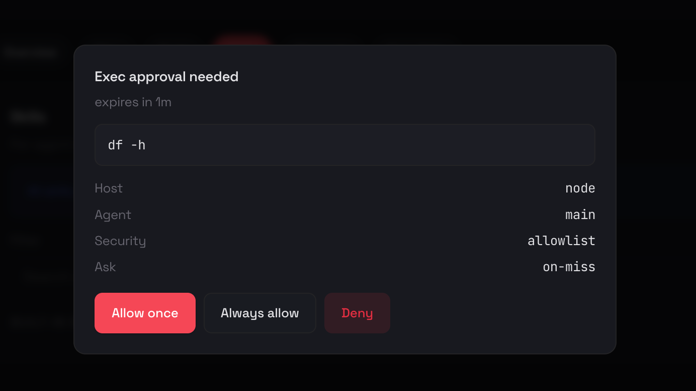

- [1. gateway 节点安装](#1-gateway-节点安装)
  - [1.1. 用户](#11-用户)
  - [1.2. 安装 Node.js](#12-安装-nodejs)
  - [1.3. 源代码安装](#13-源代码安装)
    - [1.3.1. 安装 pnpm（从源码构建时需要）](#131-安装-pnpm从源码构建时需要)
    - [1.3.2. 安装 Openclaw](#132-安装-openclaw)
  - [1.4. 自动安装](#14-自动安装)
  - [1.5. 配置](#15-配置)
  - [1.6. extra tools](#16-extra-tools)
    - [1.6.1. brew](#161-brew)
- [2. operator 节点](#2-operator-节点)
- [3. 被管理节点](#3-被管理节点)
  - [3.1. linux 服务器](#31-linux-服务器)
    - [3.1.1. 在Linux上执行](#311-在linux上执行)
    - [3.1.2. 在gateway节点上执行](#312-在gateway节点上执行)
  - [3.2. macos 笔记本](#32-macos-笔记本)
  - [3.3. android 手机](#33-android-手机)
- [4. 端口使用情况](#4-端口使用情况)
- [docker](#docker)
- [参考](#参考)
- [ollama](#ollama)
- [openclaw service](#openclaw-service)

远程模式

# 1. gateway 节点安装

## 1.1. 用户

```
sudo useradd -m -s /bin/bash openclaw
sudo su - openclaw

```

## 1.2. 安装 Node.js

先使用 nvm 安装最新的 Node.js

```
 # 升级npm
 curl -o- https://gh-proxy.com/https://raw.githubusercontent.com/nvm-sh/nvm/v0.40.3/install.sh | bash
 source ~/.bashrc
 # 设置 nvm 使用阿里云镜像
 export NVM_NODEJS_ORG_MIRROR=https://npmmirror.com/mirrors/node/
 nvm install 22
 nvm use 22
 nvm alias default 22

 # 验证 Node.js 版本：
node -v # Should print "v22.22.0".
# 验证 npm 版本：
npm -v # Should print "10.9.4".
```

## 1.3. 源代码安装

### 1.3.1. 安装 pnpm（从源码构建时需要）

```
# 方法1：使用 corepack（Node.js 22+ 内置，推荐）
# 设置 npm 使用阿里云镜像（corepack 会从此镜像下载 pnpm）
npm config set registry https://registry.npmmirror.com
corepack enable
npm config set registry https://registry.npmjs.org  # 恢复默认源（可选）

# 方法2：使用 npm 直接安装
npm config set registry https://registry.npmmirror.com
npm install -g pnpm
npm config set registry https://registry.npmjs.org  # 恢复默认源（可选）

# 验证 pnpm 版本：
pnpm -v
```

### 1.3.2. 安装 Openclaw

```
git clone git@github.com:gongysh2004/openclaw.git
cd openclaw
pnpm install
pnpm ui:build # auto-installs UI deps on first run
pnpm build
pnpm setup
source ~/.bashrc 2>/dev/null || true
pnpm link --global

```

## 1.4. 自动安装

curl -fsSL https://molt.bot/install.sh | bash

## 1.5. 配置

```
export OPENCLAW_GATEWAY_TOKEN="bf73007211a2d94743b7aed6258a7724c0356a8af843f1b4"
openclaw onboard --install-daemon
openclaw gateway
openclaw dashboard --no-open


```

## 1.6. extra tools

### 1.6.1. brew

```
curl -fsSL https://gh-proxy.com/https://raw.githubusercontent.com/Homebrew/install/HEAD/install.sh | bash
```

# 2. operator 节点

```
ssh -N -L 18789:127.0.0.1:18789 gateway

```

使用browser 打开：
http://localhost:18789/?token=3719acd1015ee84ab5c3d05c233072ce498a1467dcc23b7a

利用chat 开始聊天，它会告诉你如何进行身份初始化。

# 3. 被管理节点

## 3.1. linux 服务器

### 3.1.1. 在Linux上执行

安装命令

```
git clone https://gh-proxy.com/https://github.com/openclaw/openclaw.git
cd openclaw
pnpm build
npm i -g .

```

建立ssh 隧道：

```
ssh -N -L 18789:127.0.0.1:18789 root@gateway
```

```
export OPENCLAW_GATEWAY_TOKEN="3719acd1015ee84ab5c3d05c233072ce498a1467dcc23b7a"
openclaw nodes run --host 127.0.0.1 --port 18789 --display-name "Linux1"
```

openclaw nodes run --host 127.0.0.1 --port 18789 --display-name "gpu3" --cwd ~/.openclaw3

### 3.1.2. 在gateway节点上执行

```
echo "192.168.99.113 linux1 Linux1" >> /etc/hosts
```

在gateway节点上配置Linux1的安全信息：

```
at > /tmp/exec-approvals-fixed.json << 'EOF'
{
  "version": 1,
  "socket": {
    "path": "/root/.openclaw/exec-approvals.sock",
    "token": "WxP7JdBIW5yAnxeb8-1f4h-GOm4idtt_"
  },
  "defaults": {
    "security": "full",
    "ask": "off",
    "askFallback": "full",
    "autoAllowSkills": true
  },
  "agents": {
    "main": {
      "security": "full",
      "ask": "off",
      "askFallback": "full",
      "autoAllowSkills": true
    }
  }
}
EOF
openclaw approvals set --node Linux1 --file /tmp/exec-approvals-fixed.json
```

openclaw approvals allowlist add --node Linux1 "df"

命令行执行命令：

```
openclaw nodes run --node Linux1 -- df -h
```

命令行下会需要审批，可在UI上批准。


## 3.2. macos 笔记本

## 3.3. android 手机

AVREKdDJyqq722SK

# 4. 端口使用情况

端口 用途
18789 Gateway WebSocket（默认，也是 HTTP 控制 UI
18792 端口 18792 是 Chrome Extension Relay Server 的端口

远程模式

node \*-- remote gateway

# docker

export OPENCLAW_HOME_VOLUME="openclaw_home"
./docker-setup.sh

# 参考

[手把手教你安装OpenClaw并接入飞书，让AI在聊天软件里帮你干活](https://cloud.tencent.com/developer/article/2626160)
cli_a90062446f395bcd
EIcDSWdHPs96p8LkPhMc4f5Kw06eDrrx

[解锁 AI 助手新姿势！90%的运维都是如何使用 OpenClaw 的](https://mp.weixin.qq.com/s/jgNQwNghqCoT-JBqUD_tnw)

zi pu
8af8fb26508f4e9f9a901d1d53229f12.wHy2T6ju1LY7GQSX

# ollama

配置

```
cat ~/.openclaw/openclaw.json
  "models": {
    "providers": {
      "ollama": {
        "baseUrl": "http://127.0.0.1:11434/v1",
        "apiKey": "ollama-local",
        "api": "openai-completions",
        "models": [
          {
            "id": "qwen3-coder-next",
            "name": "qwen3-coder-next",
            "reasoning": false,
            "input": [
              "text"
            ],
            "cost": {
              "input": 0,
              "output": 0,
              "cacheRead": 0,
              "cacheWrite": 0
            },
            "contextWindow": 131072,
            "maxTokens": 16384
          }
        ]
      }
    }
  },
  "agents": {
    "defaults": {
      "model": {
        "primary": "ollama/qwen3-coder-next"
      },
      "workspace": "/root/.openclaw/workspace",
      "maxConcurrent": 4,
      "subagents": {
        "maxConcurrent": 8
      }
    }
  }
```

ollama cloud
373515dfc5a44ba3be847055472639db.0wY_NKcZBpxR51MJ5SVswPbx

```
root@gongysh-1:~# ollama list
NAME                       ID              SIZE     MODIFIED
qwen3-coder-next:latest    ca06e9e4087c    51 GB    2 weeks ago
glm-4.7:cloud              023608864819    -        2 weeks ago
```

```newconfig.yaml
model_list:
  # ==================== OpenAI Models ====================
  - model_name: qwen3-coder-next-openai
    litellm_params:
      # use openai provider instead of ollama, which
      model: openai/qwen3-coder-next:latest
      api_base: http://192.168.99.213:11434/v1
      api_key: sk-tewt
      num_retries: 3
      timeout: 300
      stream_timeout: 60
      drop_params: true

general_settings:
  # ==================== 全局重试和超时 ====================
  num_retries: 2
  timeout: 600
  request_timeout: 600
  set_verbose: false

```

```
 litellm --config  newconfig.yml --host 0.0.0.0 --port 4000 --debug
```

note: we should use openai provider to access ollama api in the newconfig file, we need more model info in its supported_openai_params section:

```
    "supported_openai_params": [
      "frequency_penalty",
      "logit_bias",
      "logprobs",
      "top_logprobs",
      "max_tokens",
      "max_completion_tokens",
      "modalities",
      "prediction",
      "n",
      "presence_penalty",
      "seed",
      "stop",
      "stream",
      "stream_options",
      "temperature",
      "top_p",
      "tools",
      "tool_choice",
      "function_call",
      "functions",
      "max_retries",
      "extra_headers",
      "parallel_tool_calls",
      "audio",
      "web_search_options",
      "service_tier",
      "safety_identifier",
      "prompt_cache_key",
      "prompt_cache_retention",
      "store",
      "response_format"
    ]
```

```
# cat ~/.openclaw/openclaw.json
{
  "meta": {
    "lastTouchedVersion": "2026.2.9",
    "lastTouchedAt": "2026-02-10T13:40:40.223Z"
  },
  "wizard": {
    "lastRunAt": "2026-02-10T13:24:55.186Z",
    "lastRunVersion": "2026.2.9",
    "lastRunCommand": "onboard",
    "lastRunMode": "local"
  },
  "agents": {
    "defaults": {
      "model": {
        "primary": "ollama/qwen3-coder-next"
      },
      "workspace": "/root/.openclaw/workspace",
      "maxConcurrent": 4,
      "subagents": {
        "maxConcurrent": 8
      }
    }
  },
  "models": {
    "mode": "merge",
    "providers": {
      "litellm": {
        "baseUrl": "http://172.16.11.60:4000/v1",
        "apiKey": "sk-any",
        "api": "openai-completions",
        "models": [
          {
            "id": "qwen3-coder-next:latest",
            "name": "Qwen3 Coder Next",
            "reasoning": false,
            "input": ["text"],
            "cost": { "input": 0, "output": 0, "cacheRead": 0, "cacheWrite": 0 },
            "contextWindow": 131072,
            "maxTokens": 16384
          }
        ]
      },
      "ollama": {
        "baseUrl": "http://192.168.99.213:11434/v1",
        "apiKey": "ollama-local",
        "api": "openai-completions",
        "models": [
          {
            "id": "qwen3-coder-next",
            "name": "qwen3-coder-next",
            "reasoning": false,
            "input": ["text"],
            "cost": { "input": 0, "output": 0, "cacheRead": 0, "cacheWrite": 0 },
            "contextWindow": 131072,
            "maxTokens": 16384
          }
        ]
      }
    }
  },
  "messages": {
    "ackReactionScope": "group-mentions"
  },
  "commands": {
    "native": "auto",
    "nativeSkills": "auto",
    "restart": true
  },
  "channels": {
    "feishu": {
      "enabled": true,
      "accounts": {
        "main": {
          "appId": "cli_a90062446f395bcd",
          "appSecret": "EIcDSWdHPs96p8LkPhMc4f5Kw06eDrrx"
        }
      }
    }
  },
  "gateway": {
    "port": 18789,
    "mode": "local",
    "bind": "loopback",
    "auth": {
      "mode": "token",
      "token": "9877e8770d87b3e946d1b4018114370e23ade17894451a5f"
    },
    "tailscale": {
      "mode": "off",
      "resetOnExit": false
    },
    "nodes": {
      "denyCommands": [
        "camera.snap",
        "camera.clip",
        "screen.record",
        "calendar.add",
        "contacts.add",
        "reminders.add"
      ]
    }
  },
  "plugins": {
    "entries": {
      "feishu": {
        "enabled": true
      }
    }
  }
}
```

# openclaw service

```
cat >/etc/systemd/system/openclaw-gateway.service <<EOF
[Unit]
Description=OpenClaw Gateway
After=network-online.target
Wants=network-online.target

[Service]
Type=simple
User=root
WorkingDirectory=/root
# Minimal PATH so the daemon finds openclaw (adjust if openclaw is elsewhere, e.g. /root/.local/share/pnpm)
Environment=PATH=/root/.local/share/pnpm/:/usr/local/bin:/usr/bin:/bin:/root/.nvm/versions/node/v22.22.0/bin
ExecStart=/root/.local/share/pnpm/openclaw gateway run
Restart=always
RestartSec=5

[Install]
WantedBy=multi-user.target
EOF
```
